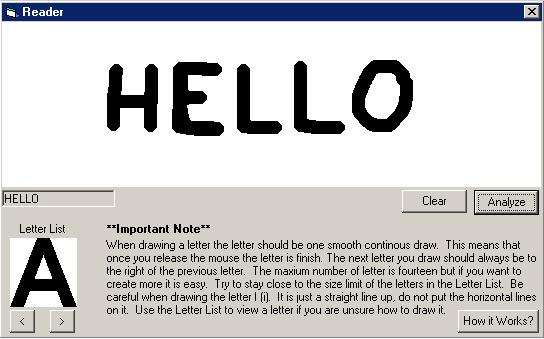



## Read \(OCR\)

### Description

This program can read!! Draw in a word and then it reads what u have typed. A full explanation of how it works is explained in the program. Its very good and pretty acurate most of the time. I have also just created a program that reads the mouse movements instead of the picture this method is a lot faster but less acurate!
 
### More Info
 

             |
---                |---
**Submitted On**   |2002-03-18 14:15:48
**By**             |[chrisM\_808](https://github.com/Planet-Source-Code/PSCIndex/blob/master/ByAuthor/chrism-808.md)
**Level**          |Intermediate
**User Rating**    |5.0 (20 globes from 4 users)
**Compatibility**  |VB 3\.0, VB 4\.0 \(16\-bit\), VB 4\.0 \(32\-bit\), VB 5\.0, VB 6\.0
**Category**       |[Complete Applications](https://github.com/Planet-Source-Code/PSCIndex/blob/master/ByCategory/complete-applications__1-27.md)
**World**          |[Visual Basic](https://github.com/Planet-Source-Code/PSCIndex/blob/master/ByWorld/visual-basic.md)
**Archive File**   |[Read\_\(OCR\)937356122002\.zip](https://github.com/Planet-Source-Code/chrism-808-read-ocr__1-35774/archive/master.zip)

